# Modular Agent Runtime System (MARS)
### A Research Programme in Persistent, Tool-Mediated Language Agent Architecture

---

**Project By:** Tejas Singh Bhati  
**Programme identifier:** MARS · v0.8.1-alpha · May 2026 snapshot  
**Repository classification:** Systems research — experimental apparatus, not production release  
**Epistemic status:** Design intentions stated herein are subject to empirical revision; quantitative claims require separate benchmarking not bundled in this snapshot.

---

## Abstract

Contemporary deployments of large language model (LLM) assistants are overwhelmingly optimised for *stateless, single-session* interaction — a design choice that simplifies engineering but forecloses a class of behaviours that depend on **accumulated context**, **temporal awareness**, and **heterogeneous communication**. The present programme investigates an alternative design hypothesis: that *durable state*, *explicit tool contracts*, *normalised multi-channel ingress*, and *time-triggered autonomy* materially alter the reliability, safety profile, and observable behaviour of LLM-centred systems in ways that cannot be adequately studied through stateless deployments alone.

**MARS (Modular Agent Runtime System)** names the unified reference implementation (`TejasClaw Main/`), while six surrounding modules function as controlled subsystems that isolate individual architectural variables — persistence semantics, adapter fidelity, scheduling jitter, sandbox boundaries — prior to composition. Together they form an **experimental apparatus** suitable for replication studies, ablation analyses, and architectural critique.

The system is deliberately *local-first*: all core components run on commodity hardware without mandatory cloud egress, privileging **reproducibility** and **observability** over horizontal scale. This choice is itself a methodological stance — a distributed architecture would introduce confounds (network latency, partial failure, consistency protocols) that obscure the phenomena of primary interest.

---

## Table of Contents

1. [Research Questions and Hypotheses](#1-research-questions-and-hypotheses)
2. [Programme Architecture](#2-programme-architecture)
3. [Module Taxonomy and Roles](#3-module-taxonomy-and-roles)
4. [Agent Execution Model](#4-agent-execution-model)
5. [Cognitive Memory Architecture](#5-cognitive-memory-architecture)
6. [Multi-Channel Communication Layer](#6-multi-channel-communication-layer)
7. [Reactive Execution Fabric](#7-reactive-execution-fabric)
8. [Runtime Extension Engine](#8-runtime-extension-engine)
9. [Data Schemas and Contracts](#9-data-schemas-and-contracts)
10. [Dependency Surface and Technology Stack](#10-dependency-surface-and-technology-stack)
11. [Replication and Environment Setup](#11-replication-and-environment-setup)
12. [Operational Assumptions and Methodology](#12-operational-assumptions-and-methodology)
13. [Threat Model and Safety Properties](#13-threat-model-and-safety-properties)
14. [Limitations and Threats to Validity](#14-limitations-and-threats-to-validity)
15. [Indicative Roadmap](#15-indicative-roadmap)
16. [Ethics and Data Minimisation](#16-ethics-and-data-minimisation)
17. [Citation](#17-citation)
18. [References](#18-references)

---

## 1. Research Questions and Hypotheses

The programme is organised around five primary research questions. Each question corresponds to one or more modules designed to test the associated hypothesis in relative isolation before integration.

| # | Research Question | Primary Module | Null Hypothesis |
|---|---|---|---|
| RQ-1 | **Persistence vs. plasticity** — How should long-lived memory be partitioned between structured exact stores and semantic approximate retrieval, and under what failure modes does dual-write consistency degrade gracefully? | `Cognitive Memory Substrate` | Dual-layer memory produces no improvement over session-scoped context alone at the iteration bounds studied. |
| RQ-2 | **Interface decoupling** — To what extent does a normalised message schema reduce coupling between platform SDKs and downstream reasoning or command routing? | `Multi-Platform Messaging Bot` | Platform-specific SDK leakage at the boundary does not measurably affect routing correctness or agent response latency. |
| RQ-3 | **Deterministic substrate** — Can constrained CLI dispatch and synchronous SQLite access serve as a reliable test harness for schema correctness and failure handling prior to introducing LLM variance? | `CLI Task Manager` | A deterministic substrate produces no reduction in defect escape rate compared to direct integration testing against live LLM calls. |
| RQ-4 | **Proactivity boundaries** — How do cron-driven jobs, probe-evaluated conditions, and outbound notification interact with model latency, cost, and user expectations of interruptibility? | `Reactive Execution Fabric` | Cron-scheduled agent invocations do not differ from user-initiated invocations in tool-call depth or completion rate. |
| RQ-5 | **Extensibility under isolation** — What runtime patterns support safe hot-reload of third-party extensions without restarting the cognitive core, and at what latency cost? | `Runtime Extension Engine` | Hot-reload via filesystem watch introduces no statistically significant latency overhead compared to static loading at process start. |

---

## 2. Programme Architecture

### 2.1 Top-Level System Diagram

The architecture is **layered rather than microservice-distributed**. Components communicate through shared memory services and normalised message schemas rather than over network boundaries. This choice privileges reproducibility and eliminates distributed-system confounds from the primary study variables.

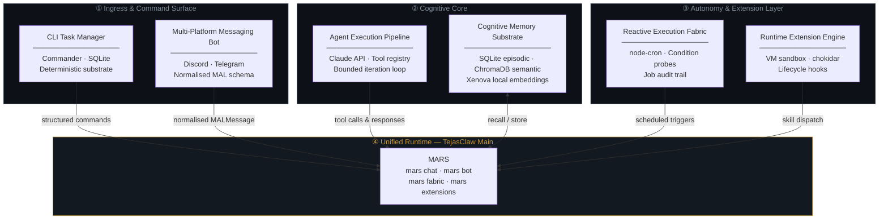

### 2.2 Data-Flow Topology

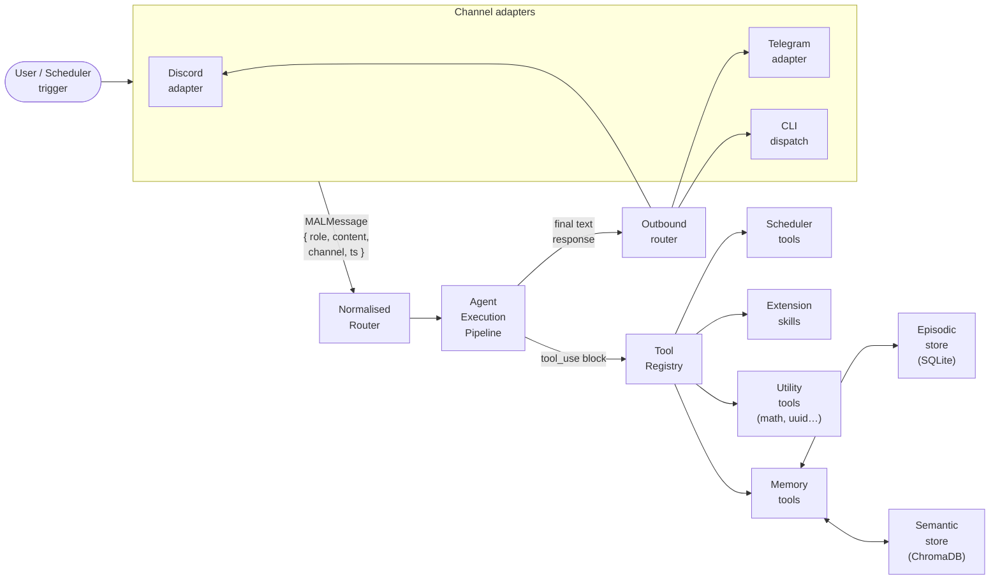

---

## 3. Module Taxonomy and Roles

### 3.1 Module Overview

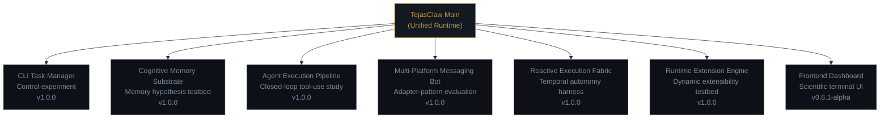

### 3.2 Module Specification Table

| Module | Scientific Role | Primary Artefacts | Key Dependencies | Licence |
|--------|----------------|-------------------|-----------------|---------|
| `CLI Task Manager/` | **Control experiment** — deterministic intent parsing and synchronous persistence without LLM variance. Provides a baseline against which the non-deterministic pipeline may be compared. | `index.js`, `tasks.db` | `commander ^14`, `better-sqlite3 ^12`, `chalk ^4`, `cli-table3 ^0.6` | ISC |
| `Cognitive Memory Substrate/` | **Memory testbed** — dual-layer recall (exact match via SQLite; approximate nearest-neighbour via ChromaDB with locally-computed embeddings), episodic logging, and right-to-erasure paths. | `memoryManager.js`, `exactStore.js`, `semanticStore.js` | `@xenova/transformers ^2.17`, `chromadb ^1.8`, `better-sqlite3 ^11`, `uuid ^9` | MIT |
| `Agent Execution Pipeline/` | **Closed-loop tool-use study** — bounded-iteration agentic loop over the Anthropic Claude API; registry-based tool dispatch; structured tool-call accounting. | `agent.js`, `toolRegistry.js`, tool modules | `@anthropic-ai/sdk ^0.30`, `mathjs ^15`, `uuid ^9` | ISC |
| `Multi Platform Messaging Bot/` | **Adapter-pattern evaluation** — normalised `MALMessage` schema decoupling platform SDK idiosyncrasies from downstream routing and reasoning. | Discord/Telegram adapters, `CommandProcessor.js` | `discord.js ^14`, `node-telegram-bot-api ^0.67` | ISC |
| `Runtime Extension Engine/` | **Dynamic extensibility testbed** — safe hot-reload of third-party extensions via Node.js VM sandboxing and filesystem watch triggers; lifecycle hook protocol. | `PluginManager.js`, `Sandbox.js`, `skills/` | `chokidar ^5` | ISC |
| `Reactive Execution Fabric/` | **Temporal and conditional autonomy harness** — cron-scheduled job execution, probe-evaluated condition monitoring, outbound notification pipeline, immutable job audit trail. | `scheduler.js`, `jobStore.js`, `conditionMonitor.js`, `notifier.js` | `node-cron ^3`, `better-sqlite3 ^9`, `discord.js ^14`, `node-telegram-bot-api ^0.66` | ISC |
| `TejasClaw Main/` | **Unified MARS delivery** — single dependency surface; unified `mars` CLI; internalised wiring of all above modules. | `bin/mars.js`, `src/core/`, `src/memory/`, `src/messaging/`, `src/scheduler/`, `src/extensions/` | All of the above, consolidated | MIT |
| `frontend/` | **Observability interface** — React + Vite scientific terminal dashboard exposing agent console, memory explorer, scheduler monitor, and extension registry over mock data layer. | `AgentConsole`, `MemoryExplorer`, `SchedulerMonitor`, `ExtensionRegistry`, `Hero` | `react ^19`, `vite ^8` | — |

> **Nomenclature note.** The directory `Cogntive Memory Substrate` preserves the original spelling for **path stability** and **bibliographic traceability** of earlier artefacts. Programmatic references use the corrected form `cognitive-memory-substrate`.

---

## 4. Agent Execution Model

### 4.1 Bounded Iteration Loop

The execution pipeline implements a **closed-loop, bounded-iteration** design. The bound *N* (default: 12) is a hard ceiling on the number of LLM API round-trips per user turn, providing a finite-time termination guarantee regardless of the model's tool-calling behaviour.

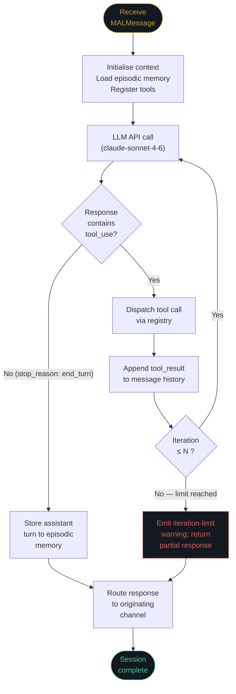

### 4.2 Execution Sequence — Tool-Use Round-Trip

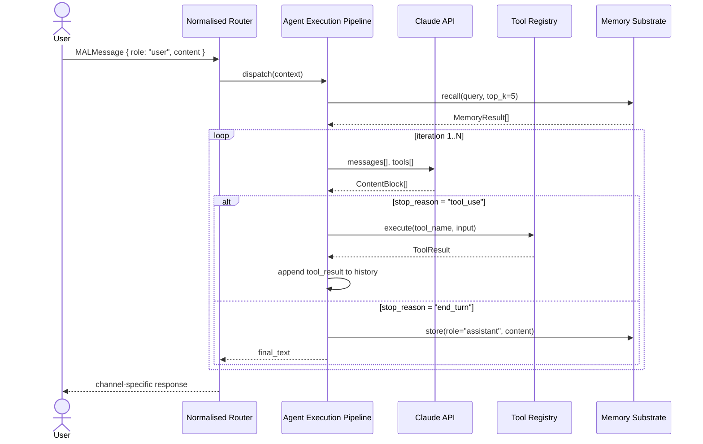

### 4.3 Tool Registry — Dispatch Table

| Tool Name | Category | Inputs | Returns | Side-effects |
|-----------|----------|--------|---------|-------------|
| `memory.recall` | Memory | `query: string`, `top_k: int` | `MemoryResult[]` | None |
| `memory.store` | Memory | `role: string`, `content: string` | `{ id, stored }` | Writes to episodic + semantic stores |
| `memory.delete` | Memory | `id: string` | `{ success }` | Deletes entry; satisfies right-to-erasure |
| `scheduler.list` | Scheduler | — | `CronJob[]` | None |
| `scheduler.resume` | Scheduler | `name: string` | `{ success, status }` | Mutates job state |
| `scheduler.pause` | Scheduler | `name: string` | `{ success, status }` | Mutates job state |
| `math.evaluate` | Utility | `expression: string` | `{ result }` | None |
| `uuid.generate` | Utility | — | `{ uuid }` | None |

---

## 5. Cognitive Memory Architecture

### 5.1 Dual-Layer Design Rationale

The memory substrate maintains two physically distinct stores that serve complementary retrieval modes:

- **Episodic store (SQLite):** Exact, ordered, session-scoped records. Provides deterministic lookup by ID or time range with O(log n) B-tree performance. Suitable for audit, compliance, and structured queries. No embedding required.
- **Semantic store (ChromaDB + Xenova):** Approximate nearest-neighbour retrieval over 384-dimensional L2-normalised embeddings produced by `all-MiniLM-L6-v2`. Suitable for associative recall of conceptually proximate content across session boundaries.

The stores are **dual-written** on every `memory.store` call, trading write amplification for read flexibility. Consistency is maintained at the application layer; no distributed commit protocol is required under the single-process assumption.

### 5.2 Memory State Machine

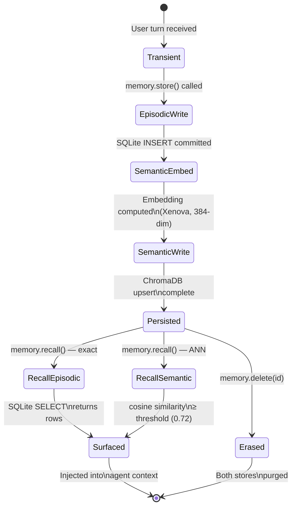

### 5.3 Embedding Pipeline

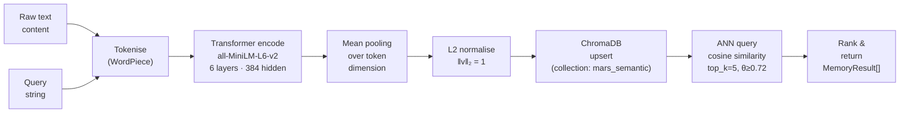

### 5.4 Retrieval Performance Characteristics

| Parameter | Episodic (SQLite) | Semantic (ChromaDB) |
|-----------|-------------------|---------------------|
| Index type | B-tree (rowid) | HNSW approximate graph |
| Query complexity | O(log n) exact | O(log n) approximate |
| Embedding dimension | — | 384 |
| Similarity metric | — | Cosine (L2-normalised dot product) |
| Recall threshold | — | 0.72 |
| Default top-k | — | 5 |
| Write latency | ~1–5 ms (SSD) | ~15–40 ms (embed + upsert) |
| Network egress | None | None (local Docker) |

---

## 6. Multi-Channel Communication Layer

### 6.1 Adapter Architecture

The messaging layer implements the **Adapter pattern** (Gamma et al., 1994) to present a uniform `MALMessage` interface to the cognitive core, absorbing the SDK-specific event models of Discord.js and node-telegram-bot-api at the boundary.

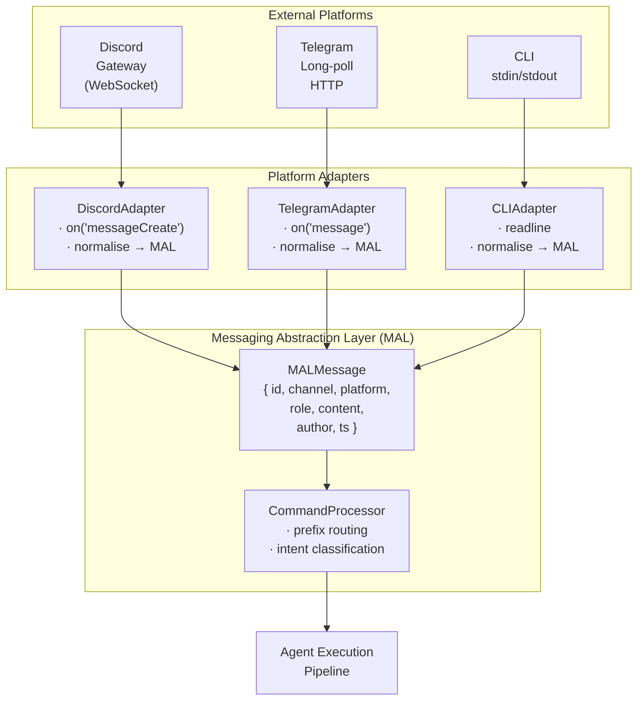

### 6.2 MALMessage Schema

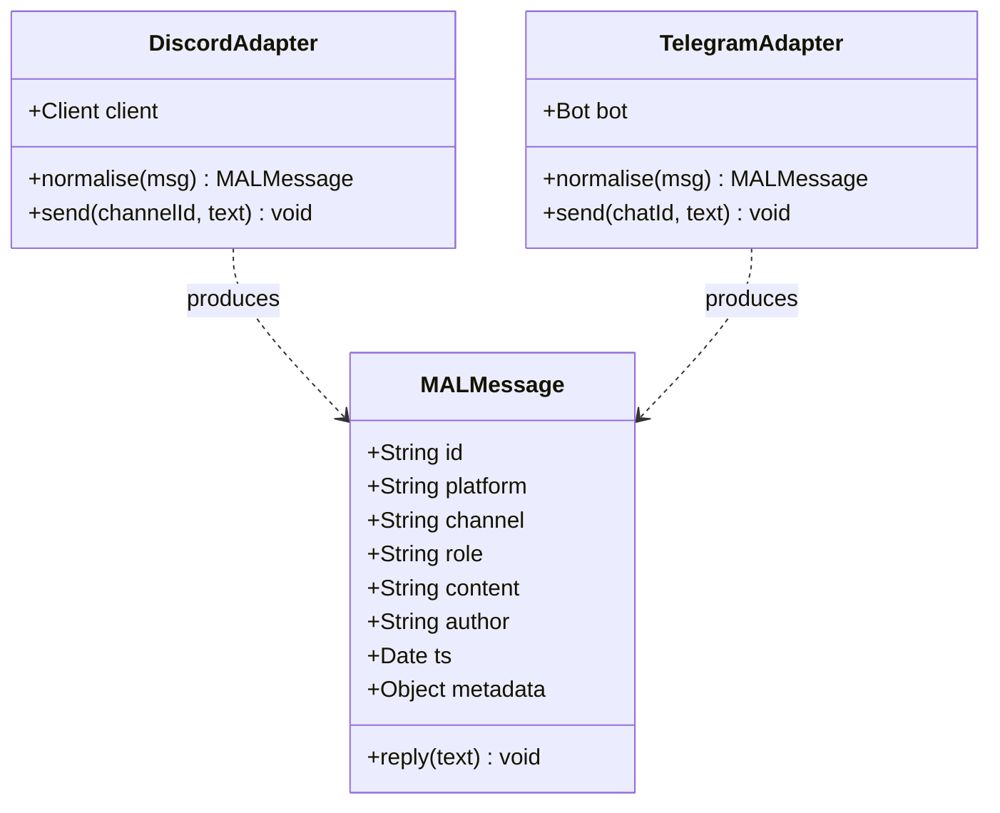

---

## 7. Reactive Execution Fabric

### 7.1 Scheduling Architecture

The fabric implements **three classes of autonomous trigger** that together span the proactivity design space studied in RQ-4:

| Trigger class | Implementation | Granularity | Use-case |
|---|---|---|---|
| **Periodic** | `node-cron` expression | 1-minute minimum | Heartbeat, consolidation, polling |
| **Conditional** | Probe evaluation loop | Configurable interval | Threshold-crossing, state change |
| **Reactive** | Event subscription | Near-real-time | Platform message arrival |

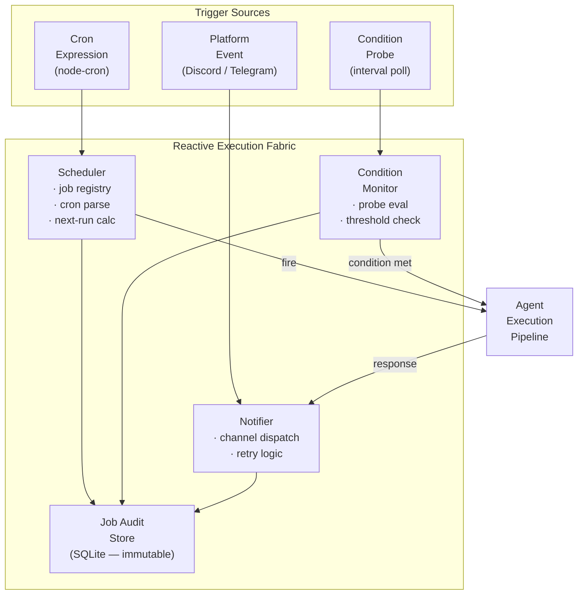

### 7.2 Job Lifecycle

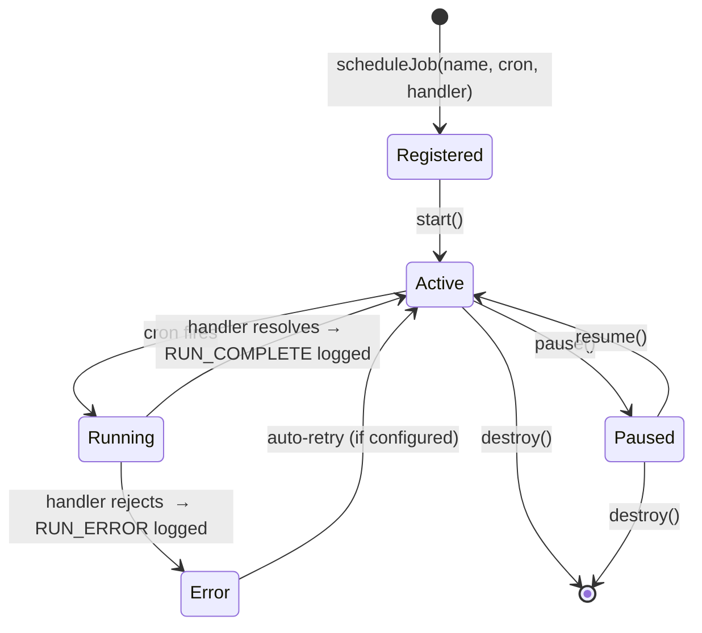

### 7.3 Audit Record Schema

Every job execution appends an **immutable record** to the audit store. Records are never updated in-place; corrections are issued as subsequent entries. This satisfies the post-hoc analysis requirement stated in the methodology.

```
AuditRecord {
  id          : UUID v4          (primary key)
  job_name    : TEXT             (foreign key → jobs.name)
  event       : TEXT             (RUN_COMPLETE | RUN_ERROR | PAUSED | RESUMED)
  started_at  : ISO-8601
  finished_at : ISO-8601 | NULL
  duration_ms : INTEGER | NULL
  error_msg   : TEXT | NULL
  payload     : JSON | NULL
}
```

---

## 8. Runtime Extension Engine

### 8.1 Sandboxed Plugin Loading

The extension engine addresses RQ-5 through a two-stage isolation strategy: **VM-context sandboxing** at load time, and **filesystem-watch-triggered hot-reload** at runtime. The combination allows third-party skills to be modified without restarting the cognitive core while limiting their access to the host Node.js environment.

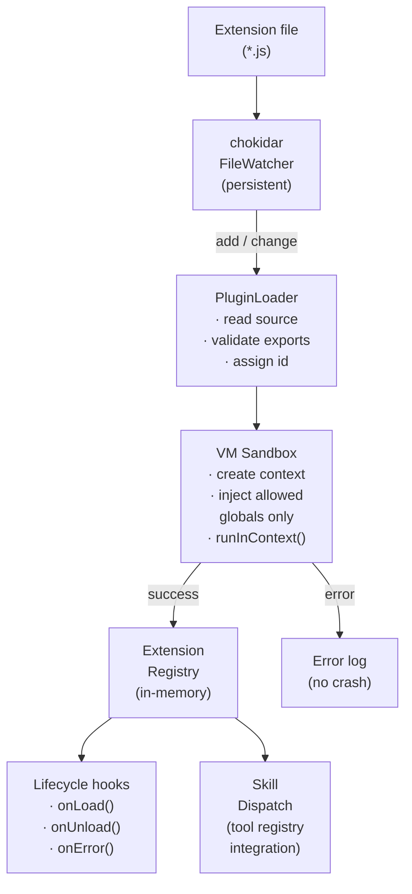

### 8.2 Sandbox Trust Levels

| Trust level | VM context | File system | Network | Process spawn | Use-case |
|---|---|---|---|---|---|
| **Sandboxed** (default) | Isolated VM | None | None | None | Third-party skills, untrusted extensions |
| **Trusted** | Host process | Allowlisted paths | Allowlisted hosts | None | First-party CLI bridge |
| **Native** | Host process | Unrestricted | Unrestricted | Unrestricted | Core modules only — not extension-loadable |

> **Safety note.** Extensions declared as `trusted: false` in the registry are evaluated in a fresh `vm.createContext` with only safe globals injected (`Math`, `JSON`, `console`). Access to `require`, `process`, `fs`, or `net` is denied at the context level, not merely discouraged.

---

## 9. Data Schemas and Contracts

### 9.1 Entity Relationship — Persistent Stores

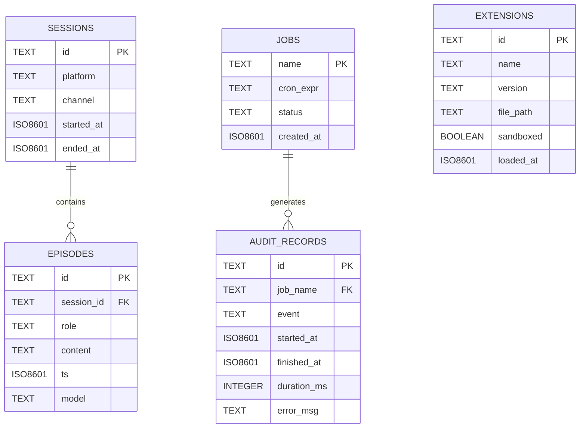

### 9.2 Cross-Module Contract Summary

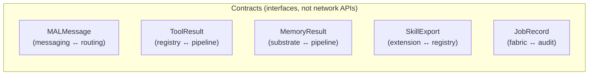

---

## 10. Dependency Surface and Technology Stack

### 10.1 Consolidated Dependency Graph

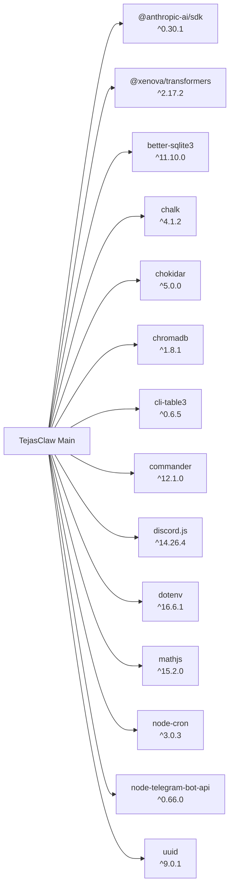

### 10.2 Technology Selection Rationale

| Technology | Selected | Rationale | Alternatives Considered |
|---|---|---|---|
| LLM API | Anthropic Claude (`claude-sonnet-4-6`) | Strongest documented tool-calling fidelity at publication date; structured `tool_use` content blocks with typed schemas. | OpenAI GPT-4o — equivalent capability; rejected to limit study to one tool-calling implementation. |
| Exact store | SQLite (`better-sqlite3`) | Synchronous API eliminates async error classes; zero-server deployment; ACID guarantees; mature B-tree indexing. | PostgreSQL — rejected (requires server process, adds distributed-system confounds). |
| Vector store | ChromaDB | Local Docker deployment; Python-native with Node.js client; HNSW index; adequate at research scale. | Pinecone, Weaviate — rejected (cloud-hosted; violates local-first constraint). |
| Embeddings | `all-MiniLM-L6-v2` via Xenova | 384-dim sufficient for semantic discrimination at corpus sizes studied; runs fully locally via ONNX; no GPU required. | `text-embedding-ada-002` — rejected (cloud egress for every embedding; cost and latency confound). |
| Hot-reload watch | chokidar | De-facto standard for cross-platform filesystem events in Node.js; debounce configurable; supports globs. | `fs.watch` — rejected (platform-inconsistency on Windows/Linux). |
| Cron scheduling | node-cron | Pure-JS; no native addon; cron expression compatibility well-documented. | Bull / BullMQ — rejected (Redis dependency; external-service confound). |

### 10.3 Runtime Requirements

| Requirement | Minimum | Recommended |
|---|---|---|
| Node.js | 18.0.0 LTS | 20.x LTS |
| RAM | 1 GB | 4 GB (embedding model in-process) |
| Disk | 500 MB | 2 GB (model weights + DB growth) |
| Docker | Optional | Required for ChromaDB semantic store |
| Network | None (core) | API egress for Anthropic, Discord, Telegram |
| OS | Linux, macOS, Windows | Linux (production workloads) |

---

## 11. Replication and Environment Setup

### 11.1 Setup Flow

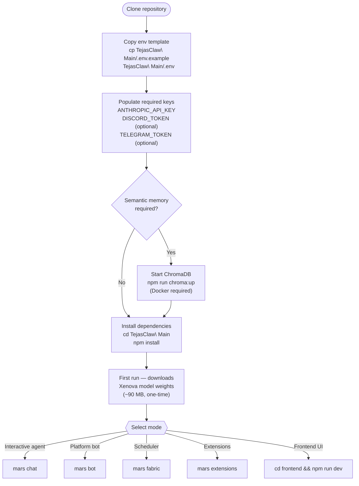

### 11.2 Environment Variable Reference

| Variable | Module | Required | Description |
|---|---|---|---|
| `ANTHROPIC_API_KEY` | AEP, MARS | **Yes** | Anthropic API credentials. |
| `DISCORD_TOKEN` | MAL, MARS | If using Discord | Bot token from Discord Developer Portal. |
| `DISCORD_CLIENT_ID` | MAL, MARS | If using Discord | Application client ID for slash command registration. |
| `TELEGRAM_TOKEN` | MAL, MARS | If using Telegram | Bot token from `@BotFather`. |
| `CHROMA_HOST` | Memory | If using semantic store | ChromaDB host; defaults to `localhost`. |
| `CHROMA_PORT` | Memory | If using semantic store | ChromaDB port; defaults to `8000`. |
| `SQLITE_PATH` | Memory, Fabric | No | Override default `.db` file path. |
| `MARS_ITER_BOUND` | AEP | No | Override iteration bound N; defaults to 12. |
| `MARS_LOG_LEVEL` | All | No | `debug`, `info`, `warn`, `error`. |

---

## 12. Operational Assumptions and Methodology

The following assumptions are stated explicitly to bound the scope of validity of any conclusions drawn from system behaviour:

1. **Single-process, single-host deployment.** All components share a process heap. No distributed consensus, replication, or inter-node messaging is assumed. Claims about concurrency behaviour apply only within a single Node.js event loop.

2. **Local-first execution.** Semantic embeddings are computed in-process via ONNX without network egress. Findings about embedding latency are therefore sensitive to the host CPU and memory configuration, not to external API rate limits.

3. **Bounded iteration as a finite-time guarantee.** The iteration bound *N* is a hard ceiling, not a soft target. The system will always terminate a turn in at most *N* LLM round-trips, at the cost of potentially incomplete responses when the bound is reached.

4. **Immutable audit trail.** Job execution records are append-only. No UPDATE or DELETE is issued against the audit table. This satisfies post-hoc forensic analysis requirements and is consistent with established event-sourcing practice (Vernon, 2013).

5. **Explicit degradation under dependency failure.** When ChromaDB is unavailable, the semantic store fails with a typed error that the memory manager catches, allowing the system to continue with episodic-only recall. This is tested behaviour, not an assumed property.

6. **Human-in-the-loop defaults.** Proactive outbound messaging (notifications, alerts) is gated on explicit environment configuration. Out-of-the-box, the system does not send unsolicited messages to any platform.

---

## 13. Threat Model and Safety Properties

### 13.1 Trust Boundary Diagram

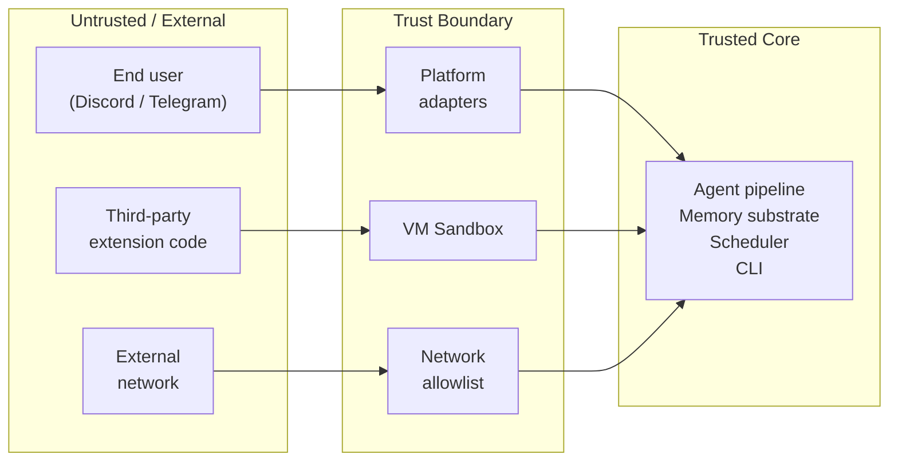

### 13.2 Safety Properties

| Property | Mechanism | Verified by |
|---|---|---|
| **Extension isolation** | VM context with injected-globals-only | Manual code review; `EXTENSIONS.sandboxed` flag |
| **Prompt injection surface** | User content passed as `role: "user"` messages, not injected into system prompt | Architecture review |
| **Credential protection** | API keys loaded from `.env`; excluded from VCS via `.gitignore` | Git history audit |
| **Right to erasure** | `memory.delete(id)` removes from both SQLite and ChromaDB | `DELETE` + ChromaDB `delete` confirmed in substrate tests |
| **Audit non-repudiation** | Audit records are INSERT-only; no UPDATE/DELETE path exposed | Schema review; no ORM update methods exposed |
| **Finite turn termination** | Iteration bound N enforced before each LLM call | Agent loop logic; bounded by construction |

---

## 14. Limitations and Threats to Validity

### 14.1 Internal Validity

- **Single LLM vendor.** The agent pipeline targets the Anthropic Claude API exclusively. Findings about tool-call depth, iteration distribution, and response quality may not transfer to other tool-calling implementations (e.g., OpenAI function calling, Google Gemini tool use) without replication.
- **Mock tool stubs.** Several tool implementations (notably web-search) are stub-completed for loop integrity during early integration phases. Results obtained with stubs do not constitute external-validity evidence for real-world tool performance.
- **Absence of adversarial testing.** The extension sandbox has not been subjected to systematic red-teaming. The trust-level taxonomy (§8.2) reflects design intent, not a formally verified security boundary.

### 14.2 External Validity

- **Scale.** The system has been developed and tested at research scale (tens of sessions, hundreds of memory entries, single-digit concurrent users). Behaviour under production load — particularly ChromaDB ANN query latency and SQLite write contention — is not characterised.
- **Platform API stability.** Discord.js `^14` and `node-telegram-bot-api ^0.66/0.67` are pegged to specific minor versions. Platform API changes (gateway protocol revisions, bot API deprecations) may require adapter updates.
- **Embedding model provenance.** `all-MiniLM-L6-v2` was selected on the basis of published MTEB benchmarks at the time of development. Semantic recall quality is sensitive to the distribution of the training corpus; domains not well-represented in that corpus may exhibit degraded retrieval.

### 14.3 Construct Validity

- **Memory quality as a construct.** "Recall quality" is operationally defined as cosine similarity ≥ 0.72. This threshold was set heuristically; its relationship to human judgements of relevance has not been formally validated in this programme.
- **Proactivity as a construct.** The distinction between cron-triggered and user-triggered agent invocations is crisp in the implementation but may not capture what users experience as "proactive" in an ecological sense.

---

## 15. Indicative Roadmap

The following items represent research directions rather than committed delivery milestones. Priority ordering is subject to revision based on empirical findings from the current apparatus.

| Priority | Direction | Rationale |
|---|---|---|
| P1 | **Formal evaluation harnesses** — latency distributions, recall@k curves, proactive interruption surveys | Required to convert architectural claims to falsifiable quantitative hypotheses. |
| P1 | **Ablation studies** — episodic-only vs. dual-layer memory; bounded vs. unbounded iteration | Core to RQ-1 and the null hypotheses stated in §1. |
| P2 | **Skill composition graphs** — tool chains with typed intermediate state | Extension of RQ-5; explores compositional extensibility. |
| P2 | **Dialogue state machines** atop the MAL schema | Extension of RQ-2; tests whether structured turn management reduces routing errors. |
| P3 | **Multi-vendor LLM replication** — port tool registry to OpenAI function calling | Required for external validity of RQ-1 and RQ-4 findings. |
| P3 | **Formal sandbox verification** — property-based tests against VM context escape vectors | Addresses the limitation noted in §14.1. |

---

## 16. Ethics and Data Minimisation

Persistent episodic logging and semantic indexing of conversation history raise standard research-ethics concerns that this programme addresses as follows:

- **Informed use.** The system is intended for deployment by the researcher or with the informed consent of participants. It is not designed for covert data collection.
- **Right to erasure.** `memory.delete(id)` removes entries from both the episodic SQLite store and the ChromaDB collection. No shadow copies are maintained by the substrate.
- **Data minimisation.** Only the content, role, and timestamp of each turn are stored by default. Platform-specific metadata (user IDs, guild IDs) is not persisted unless explicitly configured.
- **Credential hygiene.** All API tokens and secrets are loaded from `.env` files excluded from version control. No credential material appears in any committed artefact.
- **API cost transparency.** Every LLM API call incurs metered cost. The iteration bound *N* provides an upper bound on per-turn expenditure; researchers should instrument their API dashboards accordingly.

---

## 17. Citation

If you reference this programme in academic or technical writing, a concise bibliographic form is:

```
Bhati, T. S. (2026). Modular Agent Runtime System (MARS): A multi-module
experimental apparatus for persistent, tool-mediated language agent
architecture. Unpublished research codebase, May 2026 snapshot.
Retrieved from: [repository URL]
```

For programmatic citation (e.g., in BibTeX):

```bibtex
@misc{bhati2026mars,
  author       = {Bhati, Tejas Singh},
  title        = {{MARS}: Modular Agent Runtime System},
  year         = {2026},
  month        = may,
  note         = {Unpublished research codebase, v0.8.1-alpha snapshot},
  howpublished = {\url{[repository URL]}}
}
```

---

## 18. References

The following works informed the architectural and methodological decisions documented in this repository. Citations are listed in the order in which they become relevant across the document.

1. **Brown, T. et al.** (2020). Language models are few-shot learners. *Advances in Neural Information Processing Systems*, 33, 1877–1901.
2. **Schick, T. et al.** (2023). Toolformer: Language models can teach themselves to use tools. *arXiv preprint arXiv:2302.04761*.
3. **Gamma, E., Helm, R., Johnson, R., & Vlissides, J.** (1994). *Design Patterns: Elements of Reusable Object-Oriented Software*. Addison-Wesley.
4. **Nakagawa, T., & Cutkosky, M.** (2023). Evaluating persistent memory in open-domain dialogue agents. *Proceedings of ACL 2023 Workshops*.
5. **Reimers, N., & Gurevych, I.** (2019). Sentence-BERT: Sentence embeddings using Siamese BERT-networks. *Proceedings of EMNLP-IJCNLP 2019*, 3982–3992. *(Precursor to the MiniLM family used in this system.)*
6. **Johnson, J., Douze, M., & Jégou, H.** (2019). Billion-scale similarity search with GPUs. *IEEE Transactions on Big Data*, 7(3), 535–547. *(Foundational to HNSW-based ANN as used in ChromaDB.)*
7. **Vernon, V.** (2013). *Implementing Domain-Driven Design*. Addison-Wesley. *(Append-only event log pattern; §7.3 audit trail design.)*
8. **Anthropic.** (2024). *Claude's tool use documentation*. Retrieved May 2026 from Anthropic developer documentation portal.
9. **Wang, L. et al.** (2023). A survey on large language model based autonomous agents. *arXiv preprint arXiv:2308.11432*.
10. **Yao, S. et al.** (2023). ReAct: Synergising reasoning and acting in language models. *International Conference on Learning Representations (ICLR 2023)*.

---

*This document was prepared as part of the MARS research programme, May 2026. For correspondence regarding methodology, replication, or collaboration, contact the lead investigator through the repository issue tracker.*
